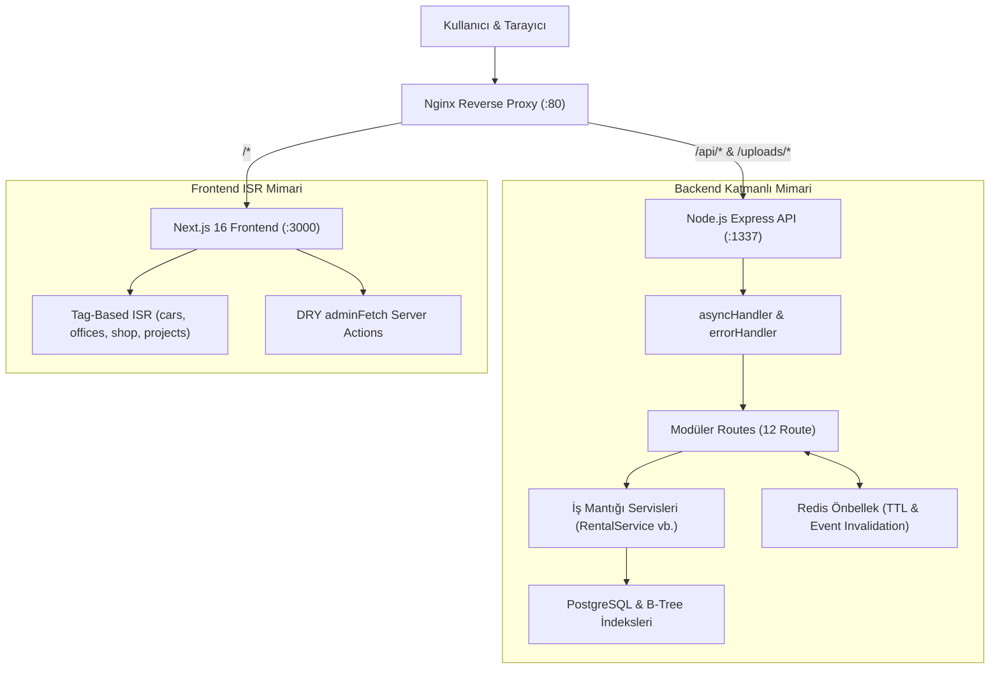

# VisionArc - Kurumsal Ekosistem & Yönetim Platformu

> E-ticaret, Araç Kiralama (Rent A Car) ve Prodüksiyon hizmetlerini tek bir yüksek performanslı mimaride birleştiren, kurumsal seviyede modern bir ekosistem yönetim platformu.

---

## 🚀 Temel Özellikler

- **Çoklu Hizmet Mimarisi**: Tek bir uygulamadan Araç Kiralama, E-Ticaret Pazar Yeri ve Medya Prodüksiyon sektörlerine birleşik erişim.
- **Yüksek Performanslı Araç Kiralama**: Müsaitlik kontrolü, anlık rezervasyon, süre uzatma, erken iade hesaplama ve ofis transferi.
- **E-Ticaret & Pazaryeri Entegrasyonu**: Trendyol, Hepsiburada ve N11 yönlendirmeli dinamik ürün kataloglama ve filtreleme.
- **Prodüksiyon & Medya Portfolyosu**: YouTube, Vimeo, Instagram, Facebook ve yerel video oynatma desteğine sahip medya vitrini.
- **Kapsamlı Yönetici Paneli (Admin Dashboard)**: Kiralamalar, araç filosu, şubeler, kullanıcılar, roller & izinler, muhasebe/finans raporları ve destek talepleri yönetimi.
- **Çok Katmanlı Önbellek & Yüksek Hız**: Redis önbellekleme ve Next.js 16 Tag-Based ISR ile milisaniyeler seviyesinde sayfa yüklenme hızı (0ms TTFB).
- **Temiz & Modüler Mimari (Clean Architecture)**: N+1 sorgu darboğazları giderilmiş, B-Tree indeksli PostgreSQL ve Controller-Service katman ayrımı.
- **Çoklu Ödeme Sağlayıcı Altyapısı**: Strategy Pattern ile tasarlanmış Iyzico, Stripe ve Test (Dummy) ödeme sağlayıcı desteği.
- **Docker Desteği**: Tek komutla ayağa kaldırılabilen Production-ready Docker Compose mimarisi.

---

## 🛠️ Teknoloji Yığını (Tech Stack)

### **Frontend:**
- **Framework:** [Next.js 16](https://nextjs.org/) (App Router, Turbopack, Server Actions)
- **Kütüphane:** [React 19](https://react.dev/)
- **Stil & Tasarım:** [Tailwind CSS v4](https://tailwindcss.com/) (`@layer base`, `@layer components`, `@layer utilities`), Google Fonts (Inter & Outfit), Material Symbols
- **Animasyon:** [Framer Motion](https://www.framer.com/motion/)
- **Önbellekleme:** On-Demand Tag-Based ISR (`revalidateTag`, `revalidatePath`)
- **Dil:** TypeScript

### **Backend:**
- **Çalışma Ortamı:** [Node.js 22](https://nodejs.org/) & [Express](https://expressjs.com/) (TypeScript)
- **Veritabanı:** [PostgreSQL 15](https://www.postgresql.org/) (B-Tree performans indeksleri ve connection pool koruması)
- **Önbellek:** [Redis 7](https://redis.io/) (Read-Through Cache & Mutation-Driven Invalidation)
- **Kimlik Doğrulama:** JWT (JSON Web Tokens), bcryptjs, Google OAuth 2.0
- **E-posta:** Nodemailer (SMTP entegrasyonu)

### **Altyapı & DevOps:**
- **Reverse Proxy:** Nginx (API, Uploads ve Frontend ters vekil sunucusu)
- **Konteynerizasyon:** Docker & Docker Compose

---

## 🏗️ Mimari & Performans İyileştirmeleri



### ⚡ Öne Çıkan Optimizasyonlar
1. **Sıfır N+1 Darboğazı:** Kiralama ve araç listeleme sorguları tekil `LEFT JOIN` SQL sorgularına dönüştürüldü. 50 araçlık bir kiralama listesinde **351 veritabanı turu ➔ 1 tekil sorguya** düşürülerek gecikme %95+ azaltıldı.
2. **PostgreSQL B-Tree İndeksleri:** Foreign key (`rental_id`, `car_id`, `user_id`), kiralama durumları, ofis ve araç müsaitlik filtrelerine indeksler eklendi.
3. **Next.js 16 Tag-Based ISR:** Public sayfalardaki `cache: 'no-store'` yükü kaldırılarak `next: { tags: [...] }` yapısına geçildi; veriler güncellendiğinde `revalidateTag` ile anında tazelenmektedir.
4. **CSS Spesifiklik Çözümü:** `globals.css` içerisindeki form stilleri `@layer base`, bileşenler `@layer components` katmanlarına taşınarak Tailwind sınıflarının ezilmesi engellendi.
5. **DRY Server Actions:** [admin.ts](file:///c:/Users/kutay/OneDrive/Masa%C3%BCst%C3%BC/visionarc/frontend/src/app/actions/admin.ts) dosyasındaki 970 satırlık tekrarlı kod, merkezi ve tip güvenli `adminFetch<T>` yardımcısı ile sadeleştirildi.
6. **Gereksiz Bağımlılık Temizliği:** Kullanılmayan Three.js, GSAP ve react-player kütüphaneleri kaldırılarak `node_modules`'ten 110 paket temizlendi, derleme süresi 3.7 saniyeye düşürüldü.

---

## ⚡ Hızlı Kurulum (Docker ile)

Sistemi çalıştırmanın en kolay yolu Docker Compose kullanmaktır.

### 1. Projeyi Klonlayın
```bash
git clone https://github.com/kullaniciadiniz/visionarc.git
cd visionarc
```

### 2. Ortam Değişkenlerini Ayarlayın
`docker-compose.yml` varsayılan geliştirme ortamı ayarlarıyla hazır gelir. İsteğe bağlı olarak `.env` dosyası oluşturabilirsiniz:
```bash
cp backend/.env.example backend/.env
```

### 3. Konteynerleri Başlatın
```bash
docker compose up -d --build
```

Servisler hazır olduğunda:
- **Web Uygulaması (Frontend):** `http://localhost:3000` veya Nginx üzerinden `http://localhost`
- **Backend API:** `http://localhost:1337/api`
- **PostgreSQL:** `localhost:5432`
- **Redis:** `localhost:6379`

### 4. Konteynerleri Durdurma
```bash
docker compose down
```

---

## 💻 Manuel Yerel Kurulum (Docker Olmadan)

### Gereksinimler:
- Node.js v20+ ve npm
- PostgreSQL 15+
- Redis 7+

### Backend'i Başlatma:
```bash
cd backend
npm install
npm run dev
```

### Frontend'i Başlatma:
```bash
cd frontend
npm install
npm run dev
```

---

## 🔒 Varsayılan Yönetici Girişi

İlk kurulumda varsayılan bir Süper Yönetici (Super Admin) hesabı otomatik olarak tanımlanır:

- **Panel Adresi:** `http://localhost:3000/admin/login`
- **E-posta:** `admin@example.com`
- **Şifre:** `admin123456`

> [!IMPORTANT]
> Güvenliğiniz için canlıya (production) almadan önce `backend/.env` içindeki `SA_PASSWORD` değerini değiştirin veya yönetim panelinden şifrenizi güncelleyin.

---

## 🌐 Demo Modu Yapılandırması

Uygulamanın en üstündeki demo bilgilendirme şeridini kapatmak için `frontend` ortam değişkenine şunu ekleyebilirsiniz:
```env
NEXT_PUBLIC_DEMO_MODE=false
```

---

## 💳 Ödeme Altyapısı (Payment Provider Pattern)

Ödeme sağlayıcıları Strategy Pattern ile modüler olarak tasarlanmıştır ([PaymentProvider.ts](file:///c:/Users/kutay/OneDrive/Masa%C3%BCst%C3%BC/visionarc/backend/src/services/payment/PaymentProvider.ts)):

1. **DummyProvider:** Test ortamları için güvenli simülasyon akışı.
2. **IyzicoProvider:** Iyzico Checkout Form ve Webhook entegrasyonu.
3. **StripeProvider:** Stripe Checkout Session ve Webhook entegrasyonu.

Canlı ortamda sağlayıcıyı devreye almak için `backend/.env` dosyasına ilgili API anahtarlarını girmeniz yeterlidir:
```env
PAYMENT_PROVIDER=iyzico # veya stripe / dummy
PAYMENT_WEBHOOK_SECRET=guvenli-webhook-anahtariniz
```

---

## 📄 Lisans

Bu proje MIT Lisansı ile lisanslanmıştır. Detaylar için [LICENSE](LICENSE) dosyasını inceleyebilirsiniz.
